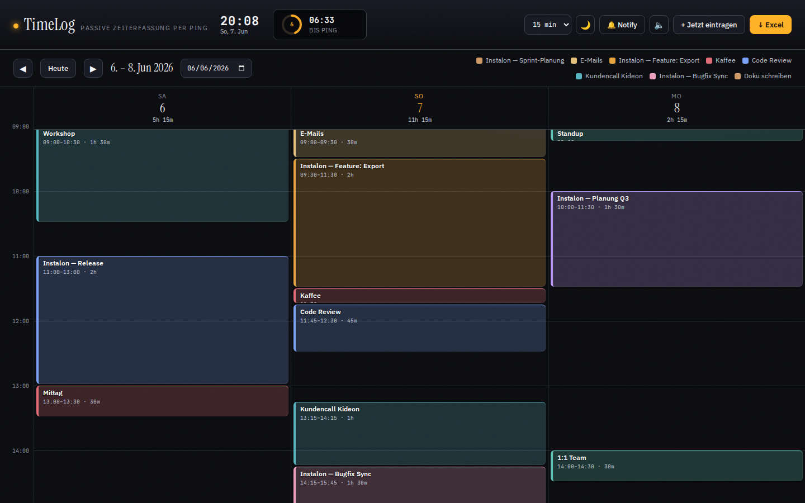
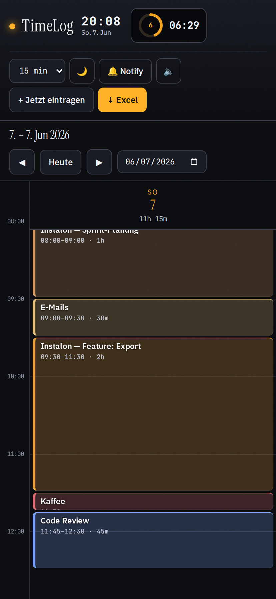
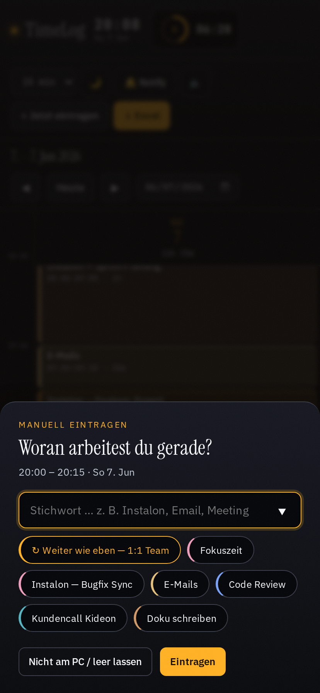
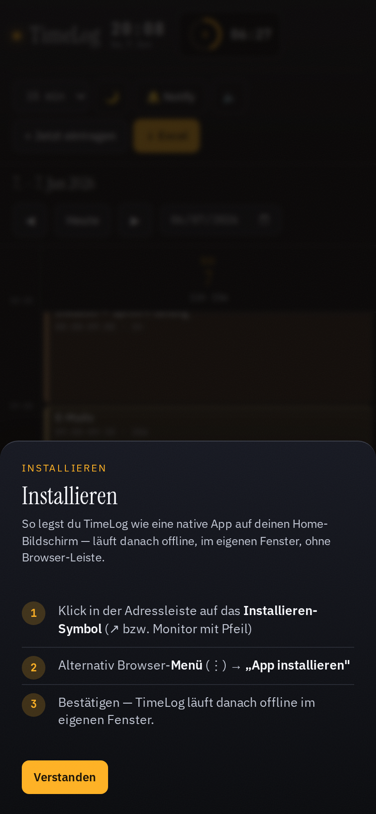
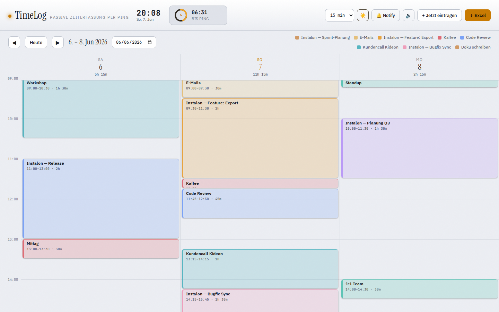

# TimeLog

**Passive Zeiterfassung per Ping.**
Live: https://jb--.github.io/timelogging/

TimeLog ist eine installierbare **Progressive Web App** — kein Backend, kein Login, läuft
offline. Sie pingt dich in festen Abständen — *„woran arbeitest du gerade?"* — du tippst ein
Stichwort, und dein Tag wächst als farbige Blöcke in einer Kalenderansicht. Am Ende
exportierst du alles als Excel.

Das Ping-Intervall ist wählbar: **60, 30, 20, 15, 10 oder 6 Minuten** (Standard 15).
Der Takt ist zugleich die Blockgröße — kürzeres Intervall = feinere Auflösung, mehr Pings.



## Idee

Klassische Zeiterfassung verlangt, dass du selbst dran denkst, Timer zu starten und zu
stoppen. TimeLog dreht das um: **es fragt dich**, in regelmäßigem Takt. Du musst nichts
steuern, nur antworten. Daraus entsteht passiv ein lückenloses Bild deines Tages.

Es ist absichtlich agnostisch, *was* du trackst — Arbeit, Lernen, Telefonate, Pausen.
Ein Slot ist einfach „was war in diesen 15 Minuten". Gedacht als ruhiges Pendant zu
Pomodoro: nicht antreiben, sondern beobachten und rückblicken.

**Leere Blöcke sind gewollt.** Nicht am Rechner = kein Block. TimeLog drängt dich nie,
Lücken zu füllen; leer lassen ist immer ein Klick.

## Wie es funktioniert

1. **Öffnen** — als installierte App, `index.html` per Doppelklick oder über GitHub Pages.
   Beim ersten Start fragt es nach Erlaubnis für OS-Benachrichtigungen.
2. **Ping** — im gewählten Takt meldet sich TimeLog (Ton + Popup + optional
   OS-Benachrichtigung). Du tippst ein Stichwort, wählst eine der letzten Tätigkeiten,
   klickst **„Weiter wie eben"** oder lässt leer. Das Intervall stellst du oben im
   Header um.
3. **Catch-up** — warst du weg, fragt TimeLog beim Zurückkommen die verpassten Slots der
   letzten ~2 Stunden ab. Einzeln füllen, „alle = X" sammeln oder leer lassen.
4. **Reviewen & nachtragen** — der gefüllte Tag steht als Blöcke in einer 3-Tage-Ansicht
   im Stil von Google Calendar. Blöcke anklicken zum Bearbeiten/Löschen, mit ◀ ▶ durch
   die Tage. Im Kalender einen Zeitbereich aufziehen (Maus-Drag) bzw. **Long-Press +
   Ziehen** am Touchscreen trägt einen Block über mehrere Slots nach und überschreibt,
   was dort liegt.
5. **Exportieren** — **↓ Excel** schreibt `Datum | Wochentag | Start | Ende | Dauer |
   Tätigkeit` als `.xlsx`, optional mit Datumsfilter.

## Als App installieren

TimeLog ist eine echte PWA: installierbar, eigenes Fenster, offline lauffähig, Home-Screen-Icon.

- **Chrome / Edge (Desktop & Android):** Installieren-Symbol in der Adressleiste — oder den
  **„↗ App installieren"**-Button oben rechts in der App.
- **iPhone / iPad (Safari):** Teilen <kbd>⬆</kbd> → **„Zum Home-Bildschirm"** → Hinzufügen.
- Der **„↗ App installieren"**-Button in der App führt dich plattformgerecht durch die Schritte.

Nach der Installation startet TimeLog im eigenen Fenster, ohne Browser-Leiste, und läuft
komplett offline.

| Tagesansicht (Mobile) | Ping (Bottom-Sheet) | Installations-Hilfe |
|---|---|---|
|  |  |  |

## Features

- **Installierbare PWA** mit App-Icons, Standalone-Fenster, App-Shortcuts
  („Jetzt eintragen", „Export") und getöntem OS-Statusbar.
- **Voll offline** dank Service Worker: App-Shell + Excel-Export-Bibliothek lokal gecacht.
- **Responsive**: 3-Tage-Kalender am Desktop, 1-Tag-Ansicht mit Bottom-Sheet-Dialogen am Handy.
- **Touch- & Maus-Bedienung**: Drag-to-select am Desktop, Tap/Long-Press am Touchscreen.
- Wählbares Intervall (60/30/20/15/10/6 Min) mit Countdown-Ring, läuft in Echtzeit weiter.
- Catch-up für verpasste Pings (Cap 2 h), Slots einzeln oder gesammelt füllen.
- 3-Tage-Kalender im Google-Calendar-Stil, „Jetzt"-Linie, aktueller Slot markiert.
- Drag im Kalender trägt einen Block über mehrere Slots nach (überschreibt Bestehendes).
- Deterministische Farben pro Tätigkeit (gleiches Stichwort = gleiche Farbe).
- Hell-/Dunkel-Theme, Quick-Picks der zuletzt genutzten Tätigkeiten.
- `.xlsx`-Export (SheetJS, lokal gebündelt) mit Datumsfilter.



## Daten & Privatsphäre

Alles bleibt lokal. Daten liegen im `localStorage` deines Browsers (Key `timelog.v1`),
überleben Reloads und verlassen nie deinen Rechner. Kein Server, kein Tracking, kein
Account. Anderer Browser oder gelöschter Speicher = die Daten sind weg, also bei Bedarf
regelmäßig als Excel exportieren.

## Tech

Vanilla HTML/CSS/JS, kein Framework, kein Build-Step. Die PWA besteht aus `index.html` +
`manifest.webmanifest` + `sw.js` (Service Worker) + `icons/`. [SheetJS](https://sheetjs.com)
ist lokal unter `vendor/` gebündelt, damit der Export auch offline (und von `file://`)
funktioniert. Sonst keine Abhängigkeiten.

Alle Pfade sind **relativ** — die App läuft unverändert auf dem GitHub-Pages-Subpfad
(`…/timelogging/`) wie auf jeder anderen Domain.

### Icons & Screenshots neu generieren

Benötigt das global installierte Playwright. Die generierten PNGs sind eingecheckt — die
Skripte braucht man nur, wenn sich Branding oder Layout ändern:

```bash
PLAYWRIGHT_MODULE="$(npm root -g)/@playwright/test/index.js" node scripts/generate-icons.mjs
PORT=8000 PLAYWRIGHT_MODULE="$(npm root -g)/@playwright/test/index.js" node scripts/screenshots.mjs
```

## Deployment (GitHub Pages)

Repo → Settings → Pages → Source: `main` / root. Fertig. GitHub Pages liefert über HTTPS aus,
damit funktionieren Service Worker und Installation out of the box.

## Lizenz

MIT — siehe [LICENSE](LICENSE).
